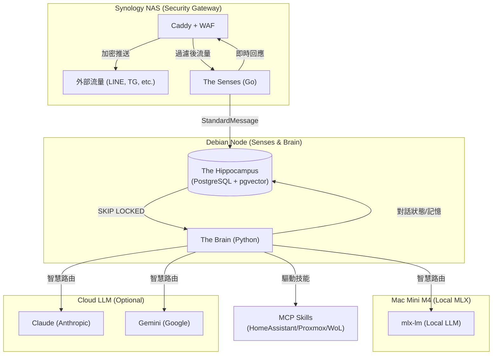

# OmniAgent (全能家管代理人)

OmniAgent 是一個基於 Go 與 Python 混合架構的多平台 AI 代理系統，旨在整合家庭私有雲 (HomeLab) 服務、通訊軟體 (LINE, Telegram) 以及最強大的大腦 (Claude/Gemini) 來實現主動式的家庭生活管理。

## 核心架構

本專案採用三層核心架構 (Logical Architecture)，並部署於跨裝置的 HomeLab 節點中。

### 1. 邏輯架構 (Three Tiers)

1.  **Security Gateway (安全閘道)**: 處理外部流量、WAF 過慮與身分驗證。
2.  **The Senses (感知閘道)**: 接收 Webhooks、轉換訊息協定並進行系統壓力管理。
3.  **The Brain (核心大腦)**: 運行 LangGraph 狀態機、處理記憶檢索、調度 LLM 並執行 MCP Skills。

### 2. 物理部署 (Three Nodes)

*   **Synology NAS (Frontend)**: 運行 Security Gateway (Caddy + Coraza WAF)。
*   **Debian 13 Node (主力運算)**: 運行 The Senses, The Brain 與 The Hippocampus (PostgreSQL)。
*   **Mac Mini M4 (推論效能)**: 運行 mlx-lm 提供本地端 OpenAI-compatible API。



## 核心功能

1.  **多平台統一身份 (Unified Identity)**: 透過 `users` 表格與 `The Hippocampus`，將不同平台的 `line_id` 與 `telegram_id` 綁定至同一個用戶，實現跨平台的上下文記憶與權限控管。
2.  **層次化記憶系統 (Memory System)**:
    *   **短期記憶**: 存儲最近的對話上下文於 `conversations` 表。
    *   **長期記憶**: 透過 `pgvector` 與 `Embedding` 實現語意召回，自動摘要家人的偏好與重要瑣事。
3.  **智慧模型路由 (ModelRouter)**: 內建原廠 SDK 適配器（Claude, Gemini, Local MLX），支援 Prompt/Context Caching 且具備自動模型升級策略 (Escalation Strategy)。
4.  **靈魂與人格注入 (SoulLoader)**: 透過 `SOUL.md` 與資料庫動態載入，定義 AI 的人格與情緒模組，讓回應具備一致且獨特的人格特質。
5.  **自適應壓力感應 (StressManager)**: Go Gateway 監控系統負載，動態調整處理策略 (Graceful Degradation 或 Model Escalation)。
6.  **安全與隱私**: 全機地端部署 (Self-hosted)，核心資料與狀態均存在本地 PostgreSQL，對外通訊皆經過加密並受 WAF 保護。


## 快速開始

### 1. 建立專案結構
若您是第一次部署，請在專案根目錄執行初始化腳本：
```bash
bash init-omni-agent.sh ./my-omni-agent
cd ./my-omni-agent
```

### 2. 配置環境變數
將 `.env.example` 複製為 `.env` 並填入您的金鑰：
```bash
cp .env.example .env
# 編輯 .env 填入 ANTHROPIC_API_KEY, TELEGRAM_BOT_TOKEN 等
```

### 3. 啟動服務
本專案全面使用 Podman (或 Docker) 容器化管理：
```bash
podman compose up -d --build
```

### 4. 驗證
*   **Gateway**: `curl http://localhost:8086/health`
*   **Brain**: `curl http://localhost:8000/health`

## 開發與 phase 歷程
詳細的開發歷程、測試結果與技術規格請參閱 `docs/` 資料夾下的 walkthrough 與 feature 文件。
