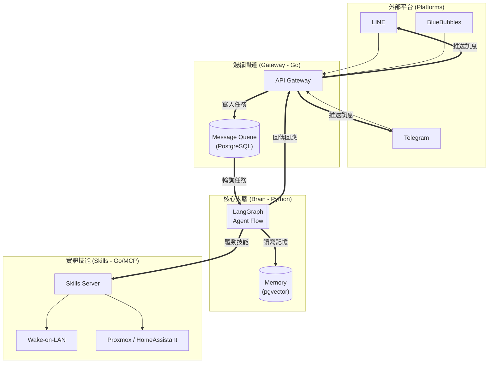

# OmniAgent (全能家管代理人)

OmniAgent 是一個基於 Go 與 Python 混合架構的多平台 AI 代理系統，旨在整合家庭私有雲 (HomeLab) 服務、通訊軟體 (LINE, Telegram) 以及最強大的大腦 (Claude/Gemini) 來實現主動式的家庭生活管理。

## 核心架構

本專案採用四層解耦架構，確保系統的穩定性、隱私性與可擴展性。



## 核心功能

1.  **多平台統一身份 (Unified Identity)**: 透過 `users` 表格，將不同平台的 `line_id` 與 `telegram_id` 綁定至同一個用戶，實現跨平台的上下文記憶與權限控管。
2.  **層次化記憶系統 (Memory System)**:
    *   **短期記憶**: 存儲最近 5-10 輪的詳細對話。
    *   **長期記憶**: 透過 `pgvector` 與 `Gemini-Embedding` 實現語意召回，自動摘要家人的偏好與重要瑣事。
3.  **靈魂與人格注入 (SoulLoader)**: 透過 `SOUL.md` 與 `CLAUDE.md` 定義 AI 的語氣、情緒模組與家庭角色，讓回應不再冷冰冰。
4.  **壓力感應機制 (StressManager)**: 自動監控系統負載與對話情境，當偵測到緊急狀況 (StressCritical) 時，會主動向管理員發起「進階模型升級」申請。
5.  **安全與隱私**: 全機地端部署 (Self-hosted)，核心資料存於 PostgreSQL，對外僅與 LLM 供應商進行必要通訊。

## 快速開始

### 1. 建立專案結構
若您是第一次部署，請在專案根目錄執行初始化腳本：
```bash
bash init-omni-agent.sh ./my-omni-agent
cd ./my-omni-agent
```

### 2. 配置環境變數
將 `.env.example` 複製為 `.env` 並填入您的金鑰：
```bash
cp .env.example .env
# 編輯 .env 填入 ANTHROPIC_API_KEY, TELEGRAM_BOT_TOKEN 等
```

### 3. 啟動服務
本專案全面使用 Podman (或 Docker) 容器化管理：
```bash
podman compose up -d --build
```

### 4. 驗證
*   **Gateway**: `curl http://localhost:8086/health`
*   **Brain**: `curl http://localhost:8000/health`

## 開發與 phase 歷程
詳細的開發歷程、測試結果與技術規格請參閱 `docs/` 資料夾下的 walkthrough 與 feature 文件。
