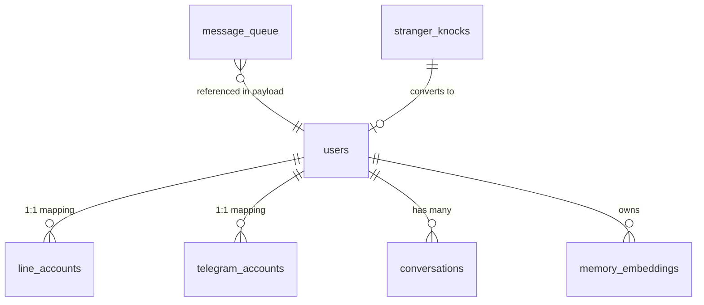

# The Hippocampus — 資料庫結構 (Database Schema)

本文件詳述 **OmniAgent** 所使用的 PostgreSQL 資料庫結構。所有時區均預設為 `Asia/Taipei`。

## 0. 全域設定與擴充 (Extensions)

- **Extensions**: `vector` (pgvector 0.8.2) — 提供語意向量儲存與檢索。
- **唯一資料源**: 專案中所有的持久化狀態均存儲於此，實現「單一事實來源」(Single Source of Truth)。

---

## 1. 核心實體關係圖 (ER Diagram)

---

## 2. 身分與用戶 (Identity & Users)

### `users` — 用戶核心表
儲存家庭成員與管理員的核心資料。

| 欄位 | 類型 | 預設值 | 說明 |
| :--- | :--- | :--- | :--- |
| `id` | uuid | `gen_random_uuid()` | 主鍵 |
| `name` | text | | 用戶名稱 |
| `role` | text | `'member'` | `admin` 或 `member` |
| `preferences` | jsonb | `'{}'` | 個人化偏好設定 |
| `access_level` | integer | `1` | 權限層級 |
| `created_at` | timestamptz | `now()` | 建立時間 |
| `updated_at` | timestamptz | `now()` | 更新時間 |

### `line_accounts` — LINE 帳號映射
| 欄位 | 類型 | 預設值 | 說明 |
| :--- | :--- | :--- | :--- |
| `line_id` | text | | LINE 內部 ID (主鍵) |
| `user_id` | uuid | | 關聯至 `users.id` (外鍵, CASCADE) |
| `created_at` | timestamptz | `now()` | 建立時間 |

### `telegram_accounts` — Telegram 帳號映射
| 欄位 | 類型 | 預設值 | 說明 |
| :--- | :--- | :--- | :--- |
| `chat_id` | text | | Telegram Chat ID (主鍵) |
| `user_id` | uuid | | 關聯至 `users.id` (外鍵, CASCADE) |
| `created_at` | timestamptz | `now()` | 建立時間 |

---

## 3. 對話與通訊 (Messaging & Conversations)

### `conversations` — 對話歷史
| 欄位 | 類型 | 預設值 | 說明 |
| :--- | :--- | :--- | :--- |
| `id` | uuid | `gen_random_uuid()` | 主鍵 |
| `user_id` | uuid | | 關聯至 `users.id` |
| `platform` | text | | `line`, `telegram`, `bluebubbles` 等 |
| `messages` | jsonb[] | `'{}'` | 包含對話內容、角色與 timestamp 的陣列 |
| `created_at` | timestamptz | `now()` | 建立時間 |
| `updated_at` | timestamptz | `now()` | 更新時間 |

### `message_queue` — 訊息處理佇列
使用 `SKIP LOCKED` 實現輕量級的 Task Queue。

| 欄位 | 類型 | 預設值 | 說明 |
| :--- | :--- | :--- | :--- |
| `id` | uuid | `gen_random_uuid()` | 主鍵 |
| `payload` | jsonb | | 訊息本體 (StandardMessage) |
| `priority` | integer | `5` | 優先順序 (數字愈大愈優先) |
| `status` | text | `'pending'` | `pending`/`processing`/`done`/`failed` |
| `stress_level` | text | | 寫入時的系統壓力等級 |
| `created_at` | timestamptz | `now()` | 寫入時間 |
| `locked_at` | timestamptz | | 被大腦取走處理的時間 |

**關鍵索引**: 
- `message_queue_pending`: `(priority DESC, created_at)` WHERE status = 'pending'

### `stranger_knocks` — 陌生人訊息紀錄
紀錄尚未綁定 `users` 的外部聯繫。

| 欄位 | 類型 | 預設值 | 說明 |
| :--- | :--- | :--- | :--- |
| `id` | uuid | `gen_random_uuid()` | 主鍵 |
| `platform` | text | | 來源平台 |
| `external_id` | text | | 外部平台 ID |
| `first_message` | text | | 第一條訊息內容 |
| `notified_at` | timestamptz | | 管理員收到通知的時間 |
| `created_at` | timestamptz | `now()` | 發生時間 |

---

## 4. 記憶與環境 (Memory & Context)

### `memory_embeddings` — 長期向量記憶 (RAG)
| 欄位 | 類型 | 說明 |
| :--- | :--- | :--- |
| `id` | uuid | 主鍵 |
| `user_id` | uuid | 關聯之用戶 ID |
| `content` | text | 記憶文本內容 |
| `embedding` | vector(768) | **關鍵**: 768 維向量 (用於 Gemini/Local Embedding) |
| `metadata` | jsonb | 包含來源、類別等詮釋資料 |
| `created_at` | timestamptz | 建立時間 |

**索引**:
- `memory_embeddings_hnsw`: HNSW 索引，使用 `vector_cosine_ops` 進行語意搜尋。

### `home_context` — 家庭環境狀態
| 欄位 | 類型 | 說明 |
| :--- | :--- | :--- |
| `key` | text | 狀態鍵名 (主鍵) |
| `value` | jsonb | 狀態數值 |
| `active` | boolean | 是否有效 |
| `updated_at` | timestamptz | 最後更新時間 |

---

## 5. 系統監控 (Monitoring)

### `stress_logs` — 小腦袋壓力日誌
| 欄位 | 類型 | 說明 |
| :--- | :--- | :--- |
| `id` | uuid | 主鍵 |
| `level` | text | 壓力等級 (Calm/Busy/Overload/Critical) |
| `metrics` | jsonb | 當時的 Queue 深度、回應延遲等指標 |
| `action_taken` | text | 系統採取的應對動作 |
| `mood` | text | 供靈魂模組注入用的情緒代碼 |
| `created_at` | timestamptz | 紀錄時間 |
