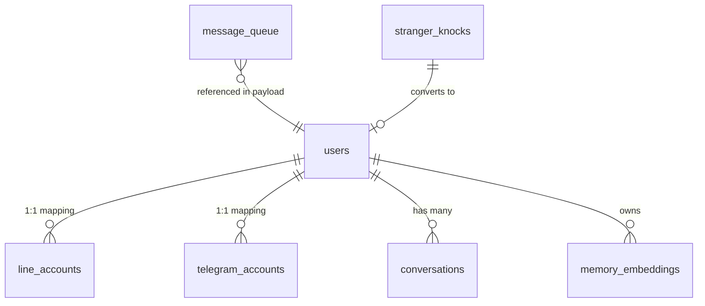

# The Hippocampus — 資料庫結構 (Database Schema)

本文件詳述 **OmniAgent** 所使用的 PostgreSQL 資料庫結構。所有時區均預設為 `Asia/Taipei`。

## 0. 全域設定與擴充 (Extensions)

- **Extensions**: `vector` (pgvector 0.8.2) — 提供語意向量儲存與檢索。
- **唯一資料源**: 專案中所有的持久化狀態均存儲於此，實現「單一事實來源」(Single Source of Truth)。

---

## 1. 核心實體關係圖 (ER Diagram)

```mermaid
erDiagram
    users ||--o{ line_accounts : "1:1 mapping"
    users ||--o{ telegram_accounts : "1:1 mapping"
    users ||--o{ conversations : "has many"
    users ||--o{ memory_embeddings : "owns"
    
    message_queue }o--|| users : "referenced in payload"
    stranger_knocks ||--o| users : "converts to"
```

---

## 2. 身分與用戶 (Identity & Users)

### `users` — 用戶核心表
儲存家庭成員與管理員的核心資料。

| 欄位 | 類型 | 預設值 | 說明 |
| :--- | :--- | :--- | :--- |
| `id` | uuid | `gen_random_uuid()` | 主鍵 |
| `name` | text | | 用戶名稱 |
| `role` | text | `'member'` | `admin` 或 `member` |
| `preferences` | jsonb | `'{}'` | 個人化偏好設定 |
| `access_level` | integer | `1` | 權限層級 |
| `created_at` | timestamptz | `now()` | 建立時間 |
| `updated_at` | timestamptz | `now()` | 更新時間 |

### `line_accounts` — LINE 帳號映射
| 欄位 | 類型 | 預設值 | 說明 |
| :--- | :--- | :--- | :--- |
| `line_id` | text | | LINE 內部 ID (主鍵) |
| `user_id` | uuid | | 關聯至 `users.id` (外鍵, CASCADE) |
| `created_at` | timestamptz | `now()` | 建立時間 |

### `telegram_accounts` — Telegram 帳號映射
| 欄位 | 類型 | 預設值 | 說明 |
| :--- | :--- | :--- | :--- |
| `chat_id` | text | | Telegram Chat ID (主鍵) |
| `user_id` | uuid | | 關聯至 `users.id` (外鍵, CASCADE) |
| `created_at` | timestamptz | `now()` | 建立時間 |

---

## 3. 對話與通訊 (Messaging & Conversations)

### `conversations` — 對話歷史
| 欄位 | 類型 | 預設值 | 說明 |
| :--- | :--- | :--- | :--- |
| `id` | uuid | `gen_random_uuid()` | 主鍵 |
| `user_id` | uuid | | 關聯至 `users.id` |
| `platform` | text | | `line`, `telegram`, `bluebubbles` 等 |
| `messages` | jsonb[] | `'{}'` | 包含對話內容、角色與 timestamp 的陣列 |
| `created_at` | timestamptz | `now()` | 建立時間 |
| `updated_at` | timestamptz | `now()` | 更新時間 |

### `message_queue` — 訊息處理佇列
使用 `SKIP LOCKED` 實現輕量級的 Task Queue。

| 欄位 | 類型 | 預設值 | 說明 |
| :--- | :--- | :--- | :--- |
| `id` | uuid | `gen_random_uuid()` | 主鍵 |
| `payload` | jsonb | | 訊息本體 (StandardMessage) |
| `priority` | integer | `5` | 優先順序 (數字愈大愈優先) |
| `status` | text | `'pending'` | `pending`/`processing`/`done`/`failed` |
| `stress_level` | text | | 寫入時的系統壓力等級 |
| `created_at` | timestamptz | `now()` | 寫入時間 |
| `locked_at` | timestamptz | | 被大腦取走處理的時間 |
| `user_id` | uuid | | （009）從 payload 反正規化，供 per-user turn 收斂查詢/鎖定 |
| `turn_id` | uuid | | （009）所屬 `turns.id`；被收斂進某個 turn 後填入 |

**關鍵索引**: 
- `message_queue_pending`: `(priority DESC, created_at)` WHERE status = 'pending'
- `message_queue_user_pending`: `(user_id, created_at)` WHERE status = 'pending'（debounce 認領）

### `turns` — 對話回合（turn 組裝與原子性，009 新增）
把同一人短時間內的多則訊息（burst）收斂成一個 **turn** 再叫 brain，turn 為**原子單位**直到 commit point。debounce 計時、per-user 序列化、解耦交付與 cancel-on-withdrawal 皆以本表為單一事實來源（gateway 多 worker，用 DB 驅動避免 in-memory timer race）。

| 欄位 | 類型 | 預設值 | 說明 |
| :--- | :--- | :--- | :--- |
| `id` | uuid | `gen_random_uuid()` | 主鍵 |
| `user_id` | uuid | | 所屬用戶 |
| `platform` | text | | `line` / `telegram` |
| `status` | text | `'assembling'` | `assembling`/`processing`/`done`/`delivered`/`cancelled`/`failed`/`undeliverable`（active = 前兩者；`undeliverable` = 投遞耗盡的 dead-letter，保留 result，010 新增） |
| `silence_deadline` | timestamptz | | reset-on-each silence timer（每來一則 bump，~4s） |
| `hard_deadline` | timestamptz | | 首訊息 + ceiling（~30s）封頂，防慢打字者餓死 |
| `commit_passed` | boolean | `false` | 原子性 commit point：true 後新輸入開新 turn |
| `cancel_requested` | boolean | `false` | withdrawal/supersede 訊號（brain 輪詢，所有路徑中斷） |
| `result` | text | | 解耦交付：brain 寫回覆全文（含 footer），forwarder 投遞 |
| `delivery_attempts` | int | `0` | （010）投遞已嘗試次數；達 5 仍失敗 → `undeliverable` |
| `next_delivery_at` | timestamptz | | （010）投遞退避閘門：NULL=立即可投，未來時間=等到期才重試（指數 base 5s、上限 300s） |
| `created_at` | timestamptz | `now()` | 建立時間 |
| `updated_at` | timestamptz | `now()` | 狀態變更時間 |

**索引**:
- `turns_one_active_per_user`: UNIQUE `(user_id)` WHERE status IN ('assembling','processing')（per-user 序列化）
- `turns_due`: `(silence_deadline)` WHERE status = 'assembling'（到期掃描）
- `turns_deliverable`: `(next_delivery_at NULLS FIRST, updated_at)` WHERE status = 'done'（投遞掃描，010 加退避閘門）
- `turns_undeliverable`: `(updated_at)` WHERE status = 'undeliverable'（010；dead-letter / admin 摘要掃描）

### `stranger_knocks` — 陌生人訊息紀錄
紀錄尚未綁定 `users` 的外部聯繫。

| 欄位 | 類型 | 預設值 | 說明 |
| :--- | :--- | :--- | :--- |
| `id` | uuid | `gen_random_uuid()` | 主鍵 |
| `platform` | text | | 來源平台 |
| `external_id` | text | | 外部平台 ID |
| `first_message` | text | | 第一條訊息內容 |
| `notified_at` | timestamptz | | 管理員收到通知的時間 |
| `created_at` | timestamptz | `now()` | 發生時間 |

### `line_pending_replies` — LINE 慢回應 postback 快取
LLM 超過門檻未回覆時，gateway 送出「取得答案」按鈕並在此建立 `pending` 列；brain 回覆先快取（`ready`），待使用者點按 postback 以新 reply token 免費投遞（`delivered`）。失敗為 `error`。清理：`pending` 留 24h、其餘留 1h，由 forwarder 心跳順手刪除。

| 欄位 | 類型 | 預設值 | 說明 |
| :--- | :--- | :--- | :--- |
| `rid` | uuid | `gen_random_uuid()` | 主鍵，postback data 攜帶的取件碼 |
| `line_id` | text | | LINE 使用者 ID（U 開頭） |
| `state` | text | `'pending'` | `pending` / `ready` / `delivered` / `error` |
| `payload` | text | | `ready` 時的回覆全文（含 footer） |
| `quote_token` | text | | 原訊息的 quoteToken，取件投遞時掛引用框（008 新增） |
| `created_at` | timestamptz | `now()` | 建立時間 |
| `updated_at` | timestamptz | `now()` | 狀態變更時間 |

索引：`idx_lpr_line_id_state (line_id, state)`。

---

## 4. 記憶與環境 (Memory & Context)

### `memory_embeddings` — 長期向量記憶 (RAG)
| 欄位 | 類型 | 說明 |
| :--- | :--- | :--- |
| `id` | uuid | 主鍵 |
| `user_id` | uuid | 關聯之用戶 ID |
| `content` | text | 記憶文本內容 |
| `embedding` | vector(768) | **關鍵**: 768 維向量 (用於 Gemini/Local Embedding) |
| `metadata` | jsonb | 包含來源、類別等詮釋資料 |
| `created_at` | timestamptz | 建立時間 |

**索引**:
- `memory_embeddings_hnsw`: HNSW 索引，使用 `vector_cosine_ops` 進行語意搜尋。

### `home_context` — 家庭環境狀態
| 欄位 | 類型 | 說明 |
| :--- | :--- | :--- |
| `key` | text | 狀態鍵名 (主鍵) |
| `value` | jsonb | 狀態數值 |
| `active` | boolean | 是否有效 |
| `updated_at` | timestamptz | 最後更新時間 |

---

## 5. 系統監控 (Monitoring)

### `stress_logs` — 小腦袋壓力日誌
| 欄位 | 類型 | 說明 |
| :--- | :--- | :--- |
| `id` | uuid | 主鍵 |
| `level` | text | 壓力等級 (Calm/Busy/Overload/Critical) |
| `metrics` | jsonb | 當時的 Queue 深度、回應延遲等指標 |
| `action_taken` | text | 系統採取的應對動作 |
| `mood` | text | 供靈魂模組注入用的情緒代碼 |
| `created_at` | timestamptz | 紀錄時間 |
